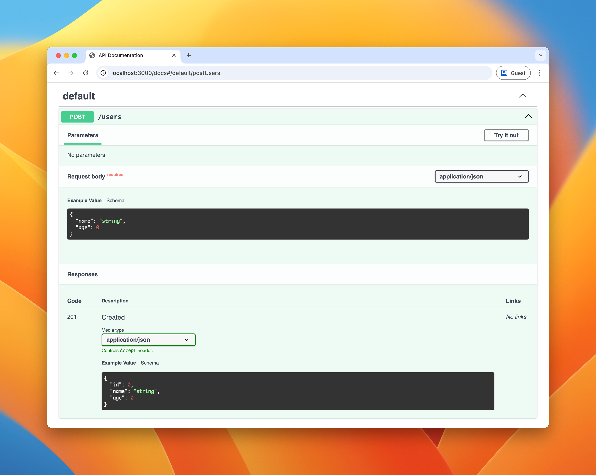

# Kori

A modern, type-safe web framework for TypeScript, built on [Hono](https://hono.dev/)'s battle-tested router.

## Features

- Fast and lightweight routing powered by Hono's router
- TypeScript type inference throughout your application
- Request and response validation with Standard Schema (Zod, Valibot, ArkType, etc.)
- OpenAPI specification generation from Standard JSON Schema
- Extensible plugin architecture

Kori also supports Standard Schema for validation with other schema libraries.

## Hello, Kori!

Here's an example with Node.js:

```bash
npm install @korix/kori @korix/nodejs-server
```

```typescript
import { createKori } from '@korix/kori';
import { startNodejsServer } from '@korix/nodejs-server';

const app = createKori();

app.get('/greeting', (ctx) => {
  return ctx.res.json({ message: 'Hello, Kori!' });
});

await startNodejsServer(app, { port: 3000 });
```

These examples use [HTTPie](https://httpie.io/), but feel free to use any other tool you prefer.

```bash
❯ http -b localhost:3000/greeting
{
    "message": "Hello, Kori!"
}
```

## With PathParams

You can use path parameters to create dynamic routes:

```typescript
const app = createKori();

app.get('/greeting', (ctx) => {
  return ctx.res.json({ message: 'Hello, Kori!' });
});

// With path parameter
app.get('/greeting/:name', (ctx) => {
  const { name } = ctx.req.params();
  return ctx.res.json({ message: `Hello, ${name}!` });
});
```

```bash
❯ http -b localhost:3000/greeting/world
{
    "message": "Hello, world!"
}
```

## With onRequest Hook

The `onRequest` hook lets you run logic before and after request handling:

```typescript
const app = createKori().onRequest((ctx) => {
  // Before handler execution
  ctx.log().info('Request started');
  ctx.defer((ctx) => {
    // After handler execution
    ctx.log().info('Request finished');
  });
});

app.get('/greeting', (ctx) => {
  ctx.log().info('Processing greeting request');
  return ctx.res.json({ message: 'Hello, Kori!' });
});
```

```bash
❯ http -b localhost:3000/greeting
{
    "message": "Hello, Kori!"
}
```

Server log output:

```bash
2025-10-16T14:33:59.683Z INFO  [app:request] Request started
2025-10-16T14:33:59.683Z INFO  [app:request] Processing greeting request
2025-10-16T14:33:59.683Z INFO  [app:request] Request finished
```

## With Request Validation

Let's create a user API with request validation.

Supported libraries ([Standard Schema](https://standardschema.dev/) compliant):

- Zod 4.0+
- Valibot 1.0+
- ArkType 2.0+

```bash
npm install @korix/std-schema-adapter @standard-schema/spec zod
```

```typescript
import { createKori } from '@korix/kori';
import { startNodejsServer } from '@korix/nodejs-server';
import { stdRequestSchema, enableStdRequestValidation } from '@korix/std-schema-adapter';
import { z } from 'zod';

const app = createKori({
  ...enableStdRequestValidation(),
});

app.post('/users', {
  requestSchema: stdRequestSchema({
    body: z.object({
      name: z.string(),
      age: z.number(),
    }),
  }),
  handler: (ctx) => {
    const { name, age } = ctx.req.validatedBody();
    return ctx.res.status(201).json({ id: 1, name, age });
  },
});

await startNodejsServer(app, { port: 3000 });
```

Valid request with correct types:

```bash
❯ http -b POST http://localhost:3000/users name=Mitz age:=45
{
    "age": 45,
    "id": 1,
    "name": "Mitz"
}
```

Invalid request with wrong type:

```bash
❯ http -b POST http://localhost:3000/users name=Mitz age=SHIIBA
{
    "error": {
        "message": "Request validation failed",
        "type": "BAD_REQUEST"
    }
}
```

## With Response Validation

You can also add response schema validation to catch unexpected responses. By default, validation failures are only logged and the response is still returned:

```typescript
import { createKori } from '@korix/kori';
import { startNodejsServer } from '@korix/nodejs-server';
import { stdRequestSchema, stdResponseSchema, enableStdRequestAndResponseValidation } from '@korix/std-schema-adapter';
import { z } from 'zod';

const app = createKori({
  ...enableStdRequestAndResponseValidation(),
});

app.post('/users', {
  requestSchema: stdRequestSchema({
    body: z.object({
      name: z.string(),
      age: z.number(),
    }),
  }),
  responseSchema: stdResponseSchema({
    '201': z.object({
      id: z.number(),
      name: z.string(),
      age: z.number(),
    }),
  }),
  handler: (ctx) => {
    const { name, age } = ctx.req.validatedBody();
    // Intentionally return invalid response for demonstration
    if (name === 'invalid') {
      return ctx.res.status(201).json({ id: 1, name });
    }
    return ctx.res.status(201).json({ id: 1, name, age });
  },
});

await startNodejsServer(app, { port: 3000 });
```

Valid response:

```bash
❯ http -b POST http://localhost:3000/users name=Mitz age:=45
{
    "age": 45,
    "id": 1,
    "name": "Mitz"
}
```

Invalid response (missing age field) is still returned as-is:

```bash
❯ http POST http://localhost:3000/users name=invalid age:=45
HTTP/1.1 201 Created
... (other headers omitted)

{
    "id": 1,
    "name": "invalid"
}
```

Server log output:

```
2025-10-15T02:13:34.470Z INFO  [sys:request] Response validation failed {
  "type": "response-validation",
  "err": {
    "body": {
      "stage": "validation",
      "reason": {
        "provider": "standard-schema",
        "type": "Validation",
        "message": "Validation error",
        "issues": [
          {
            "expected": "number",
            "code": "invalid_type",
            "path": ["age"],
            "message": "Invalid input: expected number, received undefined"
          }
        ]
      }
    }
  }
}
```

## And OpenAPI

Generate OpenAPI 3.1.0 documentation from your validation schemas.

Supported libraries ([Standard JSON Schema](https://standardschema.dev/json-schema) compliant):

- Zod 4.2+
- ArkType 2.1.28+
- Valibot 1.2+ (requires `@valibot/to-json-schema` v1.5+)

```bash
npm install @korix/std-schema-openapi-plugin @korix/openapi-swagger-ui-plugin
```

```typescript
import { createKori } from '@korix/kori';
import { startNodejsServer } from '@korix/nodejs-server';
import { swaggerUiPlugin } from '@korix/openapi-swagger-ui-plugin';
import { stdRequestSchema, stdResponseSchema, enableStdRequestAndResponseValidation } from '@korix/std-schema-adapter';
import { stdSchemaOpenApiPlugin } from '@korix/std-schema-openapi-plugin';
import { z } from 'zod';

const app = createKori({
  ...enableStdRequestAndResponseValidation(),
})
  .applyPlugin(stdSchemaOpenApiPlugin({ info: { title: 'My API', version: '1.0.0' } }))
  .applyPlugin(swaggerUiPlugin());

app.post('/users', {
  requestSchema: stdRequestSchema({
    body: z.object({
      name: z.string(),
      age: z.number(),
    }),
  }),
  responseSchema: stdResponseSchema({
    '201': z.object({
      id: z.number(),
      name: z.string(),
      age: z.number(),
    }),
  }),
  handler: (ctx) => {
    const { name, age } = ctx.req.validatedBody();
    return ctx.res.status(201).json({ id: 1, name, age });
  },
});

await startNodejsServer(app, { port: 3000 });
```

Now you can visit http://localhost:3000/docs for interactive API documentation.



## Documentation

📖 [Read the full documentation](https://bufferings.github.io/kori)

## Packages

- [`@korix/kori`](./packages/kori) - Core framework
- [`@korix/nodejs-server`](./packages/nodejs-server) - Node.js HTTP server adapter
- [`@korix/std-schema-adapter`](./packages/std-schema-adapter) - Standard Schema adapter for validation (Zod, Valibot, ArkType, etc.)
- [`@korix/std-schema-openapi-plugin`](./packages/std-schema-openapi-plugin) - OpenAPI document generation from Standard JSON Schema
- [`@korix/openapi-swagger-ui-plugin`](./packages/openapi-swagger-ui-plugin) - Interactive API documentation with Swagger UI

[View all packages →](./packages)

## License

MIT
